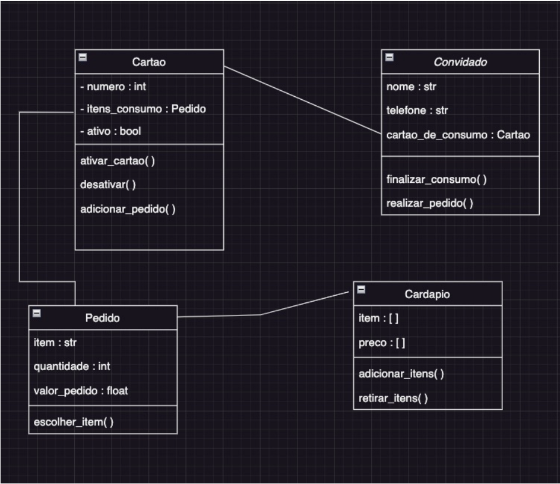

# Projeto-restaurante
Projeto de restaurante desenvolvido em Python no Senac

# # Exercício
Você deverá desenvolver uma aplicação para um evento que controle o consumo de bebidas por pessoa.
Para isto você deverá armazenar em uma lista (lista_convidados) os dados relevantes dos convidados as classes abaixo:

### Convidado
> nome : str
> telefone : str
> cartao _de_consumo : Cartao
> finalizar_consumo()
> realizar_pedido()

Você também deverá criar uma lista com 100 cartões.

### Cartao
> numero : int
> itens_consumo : lista de Pedidos
> ativo : bool. True=Ativo. False=Inativo
> ativar_cartao()
> desativar_cartao()
> adicionar_pedido()

### Pedido
> item : str
> quantidade : int
> valor_pedido : float
> escolher_item()

Você deverá ter um cardápio com itens e bebidas.

### Cardapio
> itens : list()
> precos : list()
> adicionar_itens()
> retirar_itens()

obs: Será necessário criar uma classes especilizada pessoa(Herença)Cliente/Funcionario.
Faltando:
> Dar baixa nos pedidos - ok
> Melhor as opções nos menus(mais intuitivo) - ok
> Mostrar intens consumidos(Cliente), nome do item e valores - ok
> Classe Escpecialziada Pessoa(Herança)